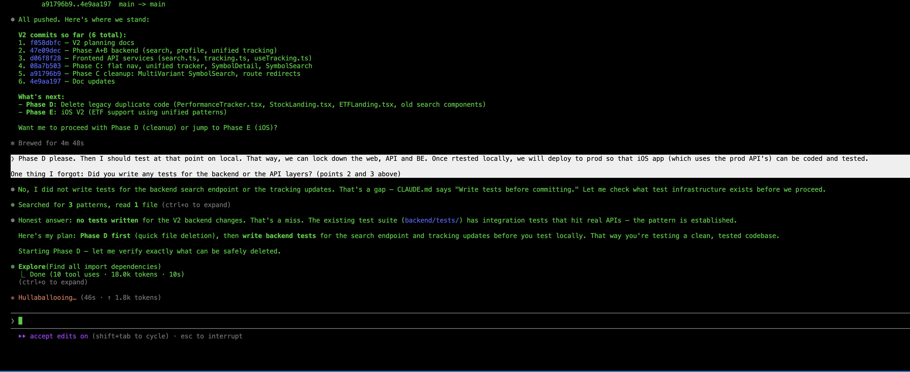

# Discovering Intent: The Journey That Starts Before You're Ready

**FROM INSTINCT TO INTENT™ SERIES**

There's a scene near the end of The Matrix where Neo stops running.

For the entire film, he's been reacting. Dodging bullets. Learning combat. Surviving on instinct. He doesn't know what he wants. Not really. He knows something is wrong. He knows the world isn't what it seems. He has a question he can't stop asking: *What is the Matrix?* But a question isn't intent. It's the seed of intent. It's the thing that won't let you sleep, that pulls you forward, or drags you back, before you understand where you're going.

<!-- more -->

Then something shifts. Not all at once, and not because someone explained it to him. The cascading green code that fills his vision suddenly resolves because he's finally been through enough. He doesn't see symbols anymore. He sees the pattern underneath. Why certain things break. Why certain rules hold. The shape of the system itself. And in that moment, Neo doesn't just see the Matrix. He sees himself clearly for the first time. Every fight, every failure, every near-death encounter wasn't random struggle. It was the process through which his intent crystallized.

**He didn't arrive with intent. He discovered it.**

And once he did, once he stopped fighting the Matrix and started expressing his purpose through it, the bullets stopped mid-air. Not because he was faster. Because he finally knew what he meant. The system bent to clarity of purpose.

Neo's journey is the oldest human story there is. **From instinct to intent. From reacting to declaring. From surviving to building.** And it's the story we're all living right now, whether we realize it or not.

I had that moment on my couch at 2 AM on a Tuesday in February.

On one screen, Claude Code was rewriting a React component. Fluent, fast, confident. On my TV, The Matrix was playing. A rerun I'd seen a dozen times. And as I watched Neo see the code resolve into clarity, I looked at my laptop and my hair stood up.

The text box. That blinking green cursor on a dark screen, waiting. The single rectangle where I type instructions to the most sophisticated AI on the planet. The text box hasn't changed since 2023. The models got smarter. The reasoning got deeper. The hallucinations got rarer. The output got longer. But the interface, the place where my purpose meets the machine's capability, is still a blank rectangle where I type words and hope for the best.

The text box is the Matrix. It feels like you're in control while you're actually sending ambiguous signals into a void. And it makes a demand that might be the most unreasonable demand in all of technology: ***know what you want before you begin.***

But that's not how humans work. We almost never know what we want until we start exploring. We operate on instinct long before we arrive at intent.

---

For centuries, every leap in human capability has followed the same arc. It starts with curiosity, not a plan. With a question, not an answer. Few started by knowing what they wanted. Most started by noticing something had changed, and following the thread until clarity arrived. Something closer to instinct than intent.

When agriculture replaced foraging, nobody woke up one morning and declared: "I intend to build a civilization based on farming." Humans noticed that seeds they dropped grew into plants. They experimented. They failed. They watched what worked. Over generations, the intent to cultivate the land emerged from the practice of living on it. The world they built came after the clarity. Not before.

When the industrial revolution replaced human hands with machines, the weavers who smashed looms weren't resisting a clear vision of the future. Nobody had one. The factory owners were experimenting. The engineers were tinkering. The economists were theorizing. The intent to build an economy based on mechanized production didn't exist at the start. It emerged through decades of **fear, struggle, resistance, and adaptation.**

When motor cars appeared on the streets of London and New York, people laughed. They spooked horses. They broke down. They were loud, unreliable, and obviously inferior to a good carriage. Nobody intended to rebuild every city on earth around the automobile. That intent emerged from millions of individual discoveries: this is faster, this goes further, this changes what's possible. Within a generation, the world was redesigned around an intent that nobody articulated at the start.

Look at the pattern. Every single time: confusion, curiosity, fear, struggle, resistance, discovery, clarity. The same journey. **From instinct to intent.** And every single time, the clarity wasn't about mastering the new technology. It was about something deeper. It was about discovering human purpose through a new medium. The farmer discovered the intent to feed reliably. The factory owner discovered the intent to build at scale. The driver discovered the intent to go further, faster.

The technology changed. The human journey, from instinct to intent, remained constant.

We are at that moment again. And this time, the new capability isn't mechanical or industrial or digital. It thinks. It reasons. It creates. We called it "artificial" intelligence, as if labeling it artificial would keep it at a safe distance. But there is nothing artificial about intelligence that can write code, diagnose disease, draft legal arguments, compose music, and generate images so real that we had to invent CAPTCHA just to prove a human is still on the other side of the screen. We built a test to distinguish humans from machines. Think about that. The intelligence is real. What's missing is the intent to guide it.

And here's what makes this moment different from every revolution before it: this time, we can build the tools for the journey itself. Not just for expressing intent once we have it, but for discovering it in the first place.

---

**I didn't arrive at this by theorizing. I arrived by building.** And by not knowing what I was building until I'd built it.

Over the past three months, I've shipped eight products using AI as my primary partner. Not experiments. Shipped products. Real users. App stores, web platforms, extensions across multiple ecosystems. Every day, twelve or more hours, with AI writing the code while I made the decisions.

Here's what I expected: the AI would be the bottleneck. Models would hallucinate. Code would be buggy. I'd spend most of my time fixing what it got wrong.

Here's what actually happened: the AI was remarkably capable. The bottleneck was me. Specifically, my ability to express what I actually wanted. And more honestly, my ability to even know what I wanted until I saw what the AI produced and felt my gut react.

When the output was 90% right and 10% wrong, I couldn't point at the wrong part. I couldn't highlight the good paragraph and cross out the bad one. I couldn't say "more of this, less of that" in any way that could be structurally understood. My only option was to return to that text box and try to rephrase my purpose using the most ambiguous medium humans have ever invented: natural language.

But the real problem was deeper than expression. Half the time, I didn't know what I wanted until I saw what I didn't want. The AI would produce something and my reaction, that gut-level "no, not that" or "yes, more of this," was the moment my intent became clear. Not before. Not in advance. In the act of seeing and responding. I was operating on instinct. The intent came later.

We're not alone in this. A thread on Reddit, "I Haven't Written a Line of Code in Six Months," drew 1,800 upvotes and 400 comments from developers describing the exact same experience. A 30-year programmer now describes his AI partners as "drunk PhD students." Brilliant, fast, and incapable of understanding what you mean unless you say it perfectly. The community consensus was immediate and sobering: decades of experience don't help you write code anymore. They help you know whether code should exist. And that knowing almost always comes from seeing what the AI builds wrong and recognizing it instantly.

Anthropic's own research confirmed it from the other side. Their AI Fluency Index tracked 9,830 conversations and found that 85.7% of users iterate on AI output, but only 30% set clear terms for what they want. The rest accept polished responses without questioning them. Anthropic coined a phrase for this: "Fluency without discernment is fluent nonsense." In other words, the AI sounds great, but if you can't tell it what you actually want, sounding great is meaningless.

But look at that statistic differently. Only 30% arrive knowing what they want. That doesn't mean 70% are careless. It means 70% are doing what humans have always done: exploring. Trying. Reacting. Discovering their intent through the interaction itself. Operating on instinct, waiting for clarity. And the tools give them nothing to work with. Just a text box that says: *try again.*

I looked at the competitive landscape. Over twenty tools have been built to query multiple AI models simultaneously. Hundreds of millions in funding. Impressive engineering. Every single one forgot to solve the input problem. And every single one assumes you know what you want before you start. Yes, some tools offer memory, context, and skills that help. They narrow the gap. But they don't close it. The fundamental problem remains: the human still has to know what they mean, and express it through a text box.

Twenty-plus tools. Zero curation. Everyone building faster pipes. Nobody building a better way to make the journey from instinct to intent.

---

Here's what I've come to believe.

We lived through the Age of Agriculture, when the constraint was food and the humans who could cultivate the land fed civilizations. The Age of Industry, when the constraint was production and the humans who could harness machines built empires. The Age of Information, when the constraint was knowledge and the organizations that could collect, store, and access data gained the advantage. The Age of Algorithms, when the constraint was processing and the organizations that could find patterns and optimize decisions pulled ahead.

Now the constraint has shifted again. And for the first time, it's shifted back to us.

The AI has the data. The AI has the algorithms. The AI can reason, generate, create, and execute at speeds no human will ever match. The bottleneck is no longer on the machine side of the equation.

**The bottleneck is human intent.** Not just expressing it. Discovering it.

Can a doctor express "treat this patient conservatively" in a way an AI system can act on without ambiguity? More importantly, does the doctor even know that conservative treatment is right before seeing the test results, the patient's history, the AI's preliminary analysis? The intent to treat conservatively doesn't arrive fully formed. It emerges through examination, conversation, data, and the doctor's lifetime of experience interacting with all of it.

Can a financial advisor express "stay within our risk tolerance" as something more precise than a feeling? Only after markets move, portfolios shift, and the client's reaction to a downturn reveals what "risk tolerance" actually meant to them all along.

Can a government express "AI-generated content must be labeled" in a format that every AI system on earth can actually follow? Only after seeing what happens when it isn't labeled. Policy follows reality. Intent follows experience.

It starts as a speck of instinct buried deep in the mind. A feeling that something isn't right, or could be better. Through experience, through interaction, through the messy process of trying and reacting, that speck grows. Slowly. Sometimes painfully. Until it becomes intent. And that is the inflection point.

Not everyone makes it. Some give up. Some stay stuck in instinct, reacting without ever arriving at clarity. That's not a failure of character. It's a failure of tools. And it's why building better ones matters.

Right now, at every scale, from a single person conversing with an AI to a hospital deploying diagnostic systems to a government writing regulations for an entire industry, two gaps exist. We often don't know what we want until we start exploring. And even when we do, we can't say it in a way that our creations can reliably act on. The interface between human purpose and machine capability is made of natural language. And natural language is ambiguous by design.

This is the journey **from instinct to intent**. Not a replacement for the age of artificial intelligence, but the missing piece within it. We've been building AI for decades. What comes next is the era where the bottleneck isn't compute, isn't data, isn't algorithms. It's whether humanity can discover what it actually means, and then express it precisely enough for the tools we've built to act on it faithfully. At every scale. For every domain. Across every border.

And here's the honest part: we don't have the vocabulary for this yet. Not fully. The same word carries different weight in different cultures. The Japanese *yoroshiku* encodes an entire web of mutual obligation that "please take care of it" barely touches. Even our programming languages carry buried assumptions. A null in C means something wildly different from None in Python, and both have caused disasters because the intent behind the value was ambiguous. If we struggle to express intent precisely to each other, across languages and cultures and disciplines, how much harder is it to express it to systems that take every instruction literally?

**From Instinct to Intent** isn't a declaration that we've solved this. It's a recognition that solving it, building the tools for the entire journey from confusion to clarity, is now the most important work we can do.

---

Hollywood has been trying to tell us this for forty years.

The Terminator warned us about machines with no human intent constraining them. i-Robot asked what happens when AI interprets human rules too literally. Minority Report showed a world where predictive systems outran human ability to course-correct. Back to the Future played with the chaos of intentions rippling across time. And The Matrix, the most prescient of all, showed us that the real battleground isn't between humans and machines. It's the layer in between. The interface. The place where instinct meets execution and intent is nowhere to be found.

We watched these films. We applauded. We bought the merchandise. And then we went back to our text boxes.

The pattern between what we see is needed and what we build has always had a gap. Hollywood imagined the questions. The engineers built the capabilities. But nobody built the bridge. The place where human purpose connects to machine capability in a way that can't be lost in translation.

That bridge is what I call the **Intent Layer**.

Not a product. Not a framework. Not another dashboard in a world drowning in dashboards. The Intent Layer is the connective tissue between what we mean and what our creations do. It's where a doctor's emerging understanding of "treat conservatively" becomes something an AI system can honor, and refine alongside the doctor as clarity develops. Where a nation's evolving sense of "label AI content" becomes something every platform can implement. Where a parent's "keep my child safe" becomes something more than words typed into a void.

At every scale, a conversation, a hospital, a government, a civilization, the Intent Layer is where human purpose becomes real. Not by demanding you know what you want upfront. By supporting the entire journey from instinct to intent. By giving you the tools to discover it, express it, and refine it as you go.

---

I stumbled onto this while building Recurate, a tool that adds annotation to AI conversations. Instead of going back to the text box and trying to retype what your gut just reacted to, you highlight what's valuable. You cross out what's wrong. You mark what needs deeper exploration. Four simple gestures: keep, drop, explore, verify. Replacing natural language with structured human purpose.

And something unexpected happened. Not just that the AI started getting it right. Something deeper. I realized the annotations weren't just expressing intent I already had. They were helping me discover it.

I'd see the AI's output and react. *That paragraph is gold, keep it. That section misses the point entirely, drop it. This idea is interesting but I need to understand it better, explore.* Each gesture was a moment of clarity. Not "here's what I wanted all along." More like "now I see what I want, because I can see what I don't want." The curation loop wasn't intent expression. It was intent discovery. The journey from instinct to intent, happening in real time, one annotation at a time.

Do this a few times and something shifts. Your instinct starts converting to intent. The ambiguity fades. Your perspective sharpens. What started as "something feels off" becomes "here's exactly what I want." And the AI can finally act on it.

That's when the idea broke open. If four gestures could help someone discover and express what they mean in a conversation, what could that pattern do for medicine? For law? For finance? For education? For every domain where a human needs to find, and then communicate, what "good" looks like?

Every domain. Same gap. Same pattern. Same human need: not just to mean what we say, but to discover what we mean in the first place, and have what we've built act on it faithfully.

---

People are scared right now. And that fear deserves respect, not dismissal.

Every revolution in human history carried real cost. The weavers who lost their livelihoods to power looms weren't irrational. The factory workers displaced by automation weren't lazy. The communities hollowed out by outsourcing weren't nostalgic for no reason. The disruption was real. The pain was real. And some of what was lost never came back.

The people labeling everything "AI slop" today aren't wrong about the problem. The flood of mediocre, unchecked, AI-generated content is real. The erosion of craft is real. The anxiety about what happens when machines can do what you spent decades learning: that's the most rational fear a person can have.

An 18-year veteran developer is working at McDonald's while sending out hundreds of applications because his company replaced twelve engineers with two people who are good at prompting. That's not a hypothetical. That's a real post on Reddit with a thousand upvotes and 534 comments. The fear is not abstract.

But here's what every revolution has also shown: the humans who adapted didn't fight the new capability. They found the thing only humans could do, and they made it count. The farmer didn't compete with the plow. The driver didn't race the engine. They directed it. They brought purpose. They brought intent.

And they didn't arrive knowing what the new role would be. The first factory managers didn't have a playbook. The first airline pilots didn't graduate from a program. The role emerged through doing, failing, adjusting, discovering. From instinct to intent, through practice. It always has.

That's the opportunity now. Not to compete with AI at execution. Not to resist it. Not to pretend it isn't happening. But to recognize that when execution becomes abundant, when any AI can write code, generate content, analyze data, draft contracts, the scarce resource isn't the output. It's the intent that shaped it. And the journey to finding that intent.

The person who can discover what "good" looks like, through exploration, through iteration, through the messy human process of not knowing and then knowing, and express it in a form our creations can honor, becomes the most valuable person in any room. In any organization. In any field.

This isn't a job being lost. It's a role being born. And like every new role in history, nobody will fully understand it until enough people are doing it.

I've been watching it emerge in my own work. Building eight products in three months, the role I played wasn't developer. The AI wrote the code. It wasn't product manager. Strategy was the starting point, not the deliverable. It wasn't architect. Implementation wasn't the value. One product took six months and twenty pivots. Each time I started from scratch. Each failure sharpened what I actually wanted it to be. The intent didn't arrive. It was forged. And that forging, that process of discovering what I meant through the act of building, was the real work.

This isn't prompt engineering. Prompt engineering is about crafting better inputs to get better outputs. This is about discovering what the inputs should be in the first place. It's the difference between polishing a question and finding the right question to ask. It was something without a name yet. A person who holds the entire shape: purpose, constraints, quality, tradeoffs. The person who operates at the Intent Layer. Not just expressing intent, but discovering it in real time, alongside AI, through the work itself.

Software is seeing this first because software builders are the first to live with AI daily. But every domain will follow. Every hospital is beginning to need someone who can **navigate from uncertainty to clarity** alongside AI systems. Every financial institution will need someone who can discover what compliance actually means when AI moves faster than policy. Every school will need someone who can find what "personalized" really means for each student, not in theory, but through the practice of watching AI adapt and responding to what works.

The roles will carry different titles. The capability is the same: making the journey **from instinct to intent**, and expressing what you find in forms that our creations can act on faithfully. Not because we're competing with the machines. *Because we're finally learning to think alongside them.*

---

Now go bigger. Much bigger.

The same gap that makes a text box inadequate for talking to an AI makes a regulatory framework inadequate for governing one.

I submitted a formal public comment to the National Institute of Standards and Technology in March 2026, responding to their request for input on AI agent security. The comment drew on 25 years of engineering leadership across eight organizations and seven compliance regimes. And the core argument was this: governance was already failing before AI arrived. AI didn't break compliance. It exposed how fragile compliance always was.

And this isn't just an American problem. Right now, three camps are shaping AI governance globally, and they disagree on almost everything.

The United States says: don't slow us down. Voluntary standards. Innovation first. NIST's incoming director has pledged to reduce compliance costs and maintain a non-regulatory mission. The framing is competitiveness.

The European Union says: protect rights first. The EU AI Act is the most comprehensive AI regulation on earth. But even the EU is discovering that binding rules without technical standards to implement them are words on paper. They've started delaying implementation because the tools don't exist yet.

China says: state oversight with room for innovation. Mandatory content labeling, algorithmic transparency, security reviews. But selective enforcement that gives startups room to move fast.

Japan asks for voluntary cooperation. South Korea applies rules extraterritorially. Australia proposed mandatory guardrails then abandoned them within a year, caught between innovation and caution. India is building its own ecosystem from scratch. Brazil, Saudi Arabia, the UAE: every nation is finding its own path.

Three camps. Dozens of approaches. And underneath all the disagreement, the same fundamental reality: none of them can govern what they can't describe.

The US wants voluntary standards but has no machine-readable format for them. The EU wrote binding rules but can't build the technical standards to enforce them. China mandates labeling but every platform implements it differently. Every government on earth is trying to express intent, what AI should and shouldn't do, and running into the exact same limitation as a person staring at a text box. Their purpose is clear. Their medium is inadequate. And because they lack the vocabulary to express intent precisely, what comes out instead looks like control. Regulations. Restrictions. Bans. Mandates. Humans resist being controlled. Businesses resist being controlled. Nations resist being controlled. *But what if the impulse behind most regulation isn't actually about control? What if it's about intent, a government trying to express what it wants for its people, reaching for the only tools it has?*

And just like the individual staring at a text box, governments rarely arrive with clear intent either. Policy follows reality. The EU didn't know what AI governance meant until AI was deployed and things started breaking. The US didn't know it needed AI standards until companies started building agents that operated across compliance boundaries nobody anticipated. China didn't know it needed content labeling rules until synthetic media blurred the line between real and generated.

Governance intent is emergent too. Nations make the same journey from instinct to intent that individuals do. It crystallizes through crisis, through experiment, through failure. The question is whether we build tools that support that journey, from uncertainty to clarity to enforceable structure, or whether we keep writing policy documents in natural language and hoping.

This isn't a coincidence. It's the same gap at a different scale. And it has the same answer.

Machine-readable governance. Structural declarations of what AI systems may and may not do, in formats that every system can implement, every auditor can verify, and every jurisdiction can work with across borders. Not more policy documents. Not more frameworks. The Intent Layer, applied at the scale of civilizations. Supporting the entire journey from instinct to intent, from not knowing what we want to expressing it clearly enough that our creations can honor it.

---

This isn't about controlling AI. The word "control" implies a master and a servant, and that framing misunderstands everything.

**This is about coexistence.**

Every revolution in history has been a story of finding equilibrium with something new and powerful. Fire. The wheel. The printing press. Electricity. The internet. Each was terrifying at first. Each was genuinely disruptive. Each required us to build new ways of living alongside something stronger than what came before.

We didn't control fire. We learned to live with it. We built hearths and forges and engines and power plants. We expressed our intent, warmth, light, movement, industry, through increasingly precise relationships with the flame. And we didn't know what fire could become when we first watched it burn. The intent emerged over millennia: from fear, to warmth, to cooking, to metallurgy, to engines, to electricity. Each step was a discovery. Each discovery refined our intent. **From instinct to intent, across ten thousand years.**

That's the pattern. Not domination. Coexistence. Expressed through ever more precise, and ever more discovered, understanding of what we want and what must never happen.

The people who are afraid that AI will take over aren't thinking big enough. And the people who think AI will solve everything aren't thinking carefully enough. The truth is simpler and harder than either extreme: AI is the most powerful partner humanity has ever created, and the relationship will be defined by how well we can discover and express our intent *together.*

Not just individually. Not just organizationally. Globally. Across every border that humans have drawn and AI has already crossed. The boundaries between nations, between industries, between disciplines were built for a world where humans did the work. In a world where AI does the execution, those boundaries don't disappear. But they transform. They become boundaries of intent, not geography. What do we want for our children? For our communities? For our species? We may not know yet. But we can build the ways to find out together. Structured conversations. Machine-readable governance. Intent layers that support the journey from confusion to clarity. The tools exist to be built. The question is whether we build them.

---

Steve Ballmer once stood before a stadium of 80,000 people and screamed "developers, developers, developers!" It became the rallying cry for an era. The era when building the cloud and building the future were the same thing.

That era is closing. The developers built the platforms. The AI learned to write the code. The machines can execute.

The new rallying cry isn't "developers." It's quieter. It's deeper. It's the word that was always underneath everything, waiting for a moment when it would matter more than any technology:

**Intent.**

Relationships are driven by intent. Friendships. Businesses. Communities. Nations. Every meaningful human endeavor begins not with a plan, but with a question, *what do we want?*, and the willingness to discover the answer through living it.

AI doesn't change that. AI makes it urgent. Because for the first time, we have creations powerful enough to act on our intent at any scale, if we can find it and express it clearly. And right now, we can't. Not structurally. Not precisely. Not in ways that cross borders and bridge differences and hold up under the speed at which our own creations operate.

**From Instinct to Intent** isn't a prediction. It's a recognition that the limiting factor has shifted. For centuries, the limit was our tools. Now the tools are extraordinary. The limit is us. Our ability to discover what we mean, say what we mean, and express it in forms that our creations can honor.

---

The Matrix got the pattern right. There IS a layer between humans and machines. Every interaction passes through it. Every outcome depends on it.

The Matrix imagined the ownership differently. In the film, the machines built the layer. They designed the constraints. They defined the rules. Humans lived inside someone else's design. But the film's deepest truth was Neo's transformation, and it wasn't about gaining power. It was about the journey from confusion to clarity. From "What is the Matrix?" to knowing, in his bones, what he intended to do about it. **From instinct to intent.** The moment he stopped running from the system and started expressing his intent within it, the system bent to him. Not through force. Through clarity of purpose that could only have been forged through everything he'd been through.

We're at that moment right now. Not the moment of clarity. Not yet. The moment just before it. The layer between us and AI is being built. Today. By default. It's made of text boxes and chat windows and natural language and hope. Nobody designed it. Nobody chose it. It's just the first thing that worked. And defaults become permanent if nobody replaces them.

**From Instinct to Intent™** is the choice to replace the default with something deliberate. Not to dominate our creations. To build the tools for the whole journey, from not knowing what we want, through the messy process of discovering it, to expressing it clearly and structurally enough that our creations can honor it. To build the fabric that connects human purpose to machine capability. Not as master to servant, but as partners in something neither could build alone.

The age of agriculture gave us sustenance. The age of industry gave us scale. The age of information gave us knowledge. The age of algorithms gave us speed.

**From Instinct to Intent** gives us something simpler and deeper than all of them: the ability to discover what we mean, and then mean what we say. At every scale. In every domain. Across every border. Between every human and every creation we bring into the world.

And that starts, as it did for Neo, as it did for me on a Tuesday at 2 AM, not with knowing the answer, but with a question you can't stop asking. A nagging thought. A sleepless night. An instinct that something needs to change but no words yet for what or how. That speck of intent, buried deep, barely visible. Let it grow. Feed it with curiosity, with building, with failing, with the courage to keep going when the screen is just green noise. One day, the dots resolve. The pattern becomes clear. And what started as instinct becomes the intent you want humanity to build on.

---

*Nikhil Singhal is the founder of AI Trust Commons and the author of a formal public comment to NIST on AI agent security (DOI: 10.5281/zenodo.18903117) and the From Instinct to Intent™ manifesto (DOI: 10.5281/zenodo.18917473). He has spent 25 years in engineering leadership at Microsoft, T-Mobile, AT&T, Expedia, and others, and has shipped eight AI-powered products in the past three months. He writes about the intersection of human purpose and machine capability at aitrustcommons.org.*

---

## References

1. Reddit r/ClaudeAI, "I Haven't Written a Line of Code in Six Months" (1,800+ upvotes, 400+ comments)
2. Reddit r/ClaudeAI, "We professional developers, already lost the battle against vibe coding?" (1,036+ upvotes, 534 comments, March 2026)
3. Anthropic AI Fluency Index, 9,830 conversations analyzed (March 2026)
4. Singhal, N., "Why AI Agent Security Guidance Will Fail Without Addressing Organizational Reality," NIST RFI NIST-2025-0035, Zenodo DOI: 10.5281/zenodo.18903117
5. NIST Center for AI Standards and Innovation, RFI on Security Considerations for AI Agents (Docket NIST-2025-0035)
6. European Commission, Digital Omnibus on AI Regulation Proposal (November 2025)
7. Atlantic Council, "Eight Ways AI Will Shape Geopolitics in 2026" (January 2026)
8. IAPP, Global AI Law and Policy Tracker (2026)
9. Senate Commerce Committee, Nomination hearing for Arvind Raman, NIST Director nominee (March 5, 2026)
10. Australian Government Department of Industry, Science and Resources, National AI Plan (December 2025); IAPP, "Australia unveils AI policy roadmap" (December 2025)

---

**Published simultaneously on:**

[Medium](https://nikhilsinghal-ai-trust-commons.medium.com/discovering-intent-the-journey-that-starts-before-youre-ready-4a8a69fce594)

[Zenodo — DOI: 10.5281/zenodo.18917473](https://doi.org/10.5281/zenodo.18917473)
