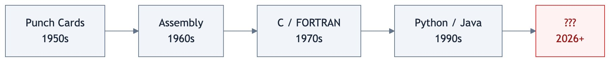
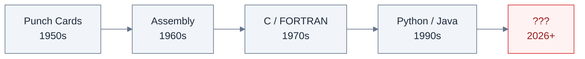
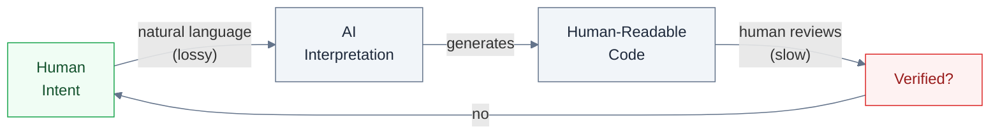
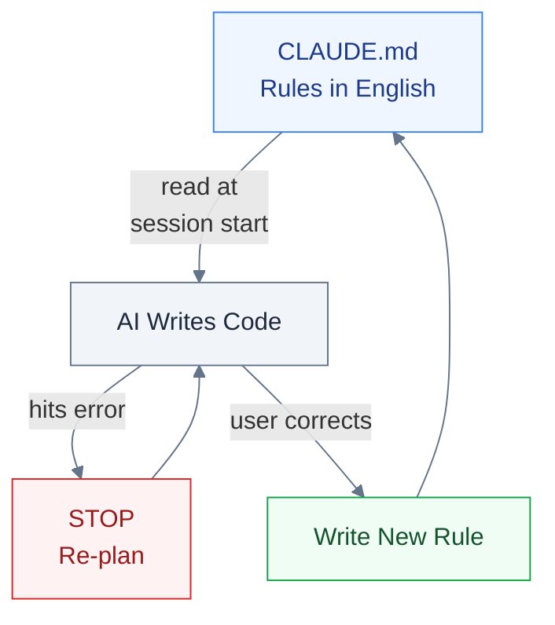
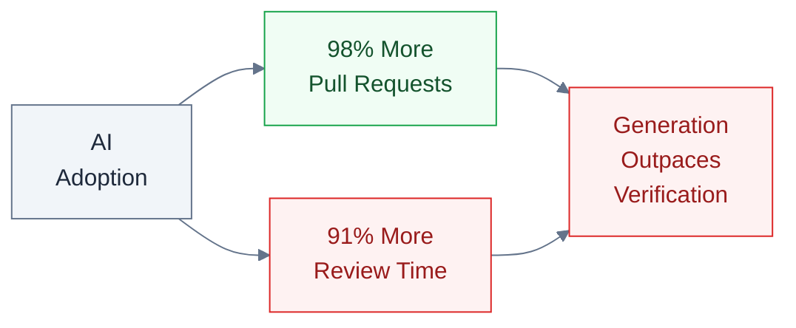
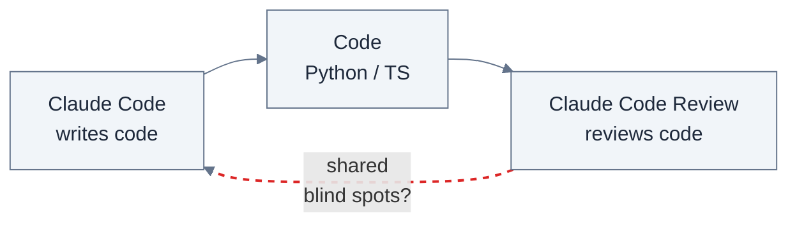
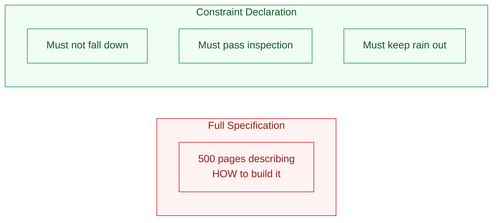
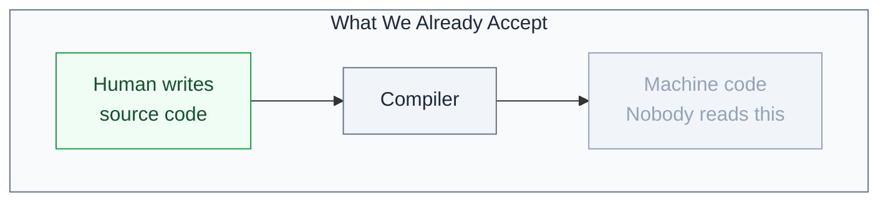
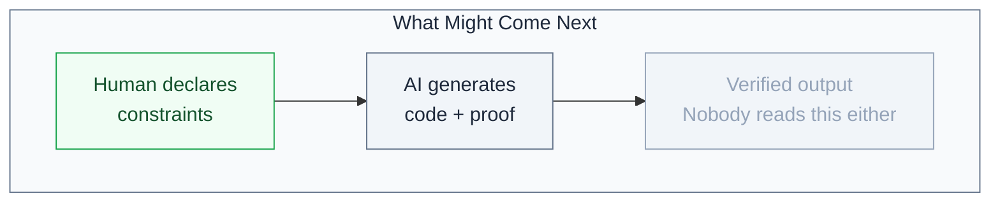
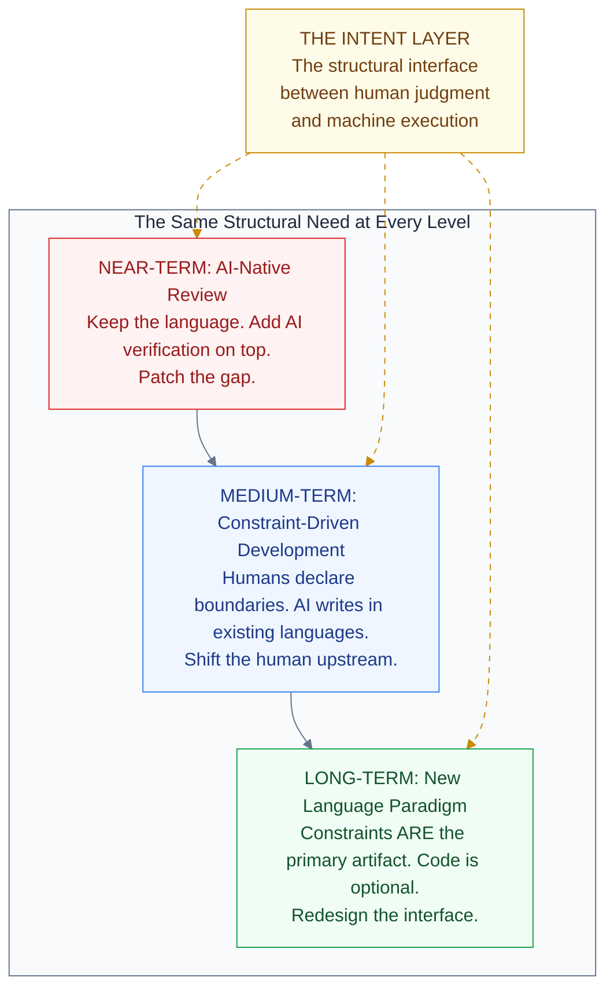

# We Are Making AI Write Code in Languages Designed for Humans. That Is the Problem.

**FROM INSTINCT TO INTENT™ SERIES**

Every programming language ever created was designed for humans, not AI.

That sounds obvious. But sit with it for a minute, because the implications are not obvious at all.

<!-- more -->

Variable naming exists because humans need to remember what things are. Indentation exists because humans need to see scope. Semicolons, brackets, type annotations, error messages written in English. All of it designed for the way human brains read, write, and debug code.

For decades, that made perfect sense. Humans were the ones writing the code. The language was the interface between human thought and machine execution.

This is not the first time we have asked what languages should look like. In the 1950s, Grace Hopper built the first compiler and had to convince skeptics that computers could understand anything beyond raw binary. Before her, programmers fed instructions to machines on physical punch cards, one operation at a time. Assembly language gave those operations names humans could read. COBOL and FORTRAN gave them structure. C gave them portability. Python gave them simplicity. Every generation moved in the same direction: closer to how humans think, further from how machines execute.

*Figure 1: The evolution of programming languages from punch cards to Python. Each generation moved closer to human thinking. But the author is no longer human. Does the next step keep moving toward us, or fork in a new direction?*

The human was always the author. Making the language more human was always the right move.

But what happens when the human is no longer the one writing the code?

---

## The Observation

I build with AI every day. For the past ten months, Claude Code has been my primary development partner across fourteen repos and nearly three thousand commits. I watch it write hundreds of lines of TypeScript, hit an error, back up, restructure, try again.

A surprising number of the errors it hits are not logic failures. They are language constraints that exist because a human was supposed to be the one typing. The AI does not need indentation to understand scope. It does not need variable names to track state. It does not need semicolons to know where a statement ends.

And yet it writes in a language designed for my eyes and my fingers. Then I review its output to verify that the intent I had in my head made it through two translation layers: from my natural language prompt, into the AI's interpretation, and out through a programming language designed for neither of us in this new arrangement.

*Figure 2: The current AI code generation workflow. Human intent passes through two lossy translation layers before reaching code that a human must then review manually. The bottleneck is structural, not speed.*

That is a lot of surface area for things to go wrong. And they do.

I am not the only one who sees this. Boris Cherny, who created Claude Code at Anthropic, recently shared his daily workflow. It is revealing. He runs five to fifteen Claude instances in parallel. He starts every session in Plan mode, iterating until the plan is right before the AI writes a single line of code. His team maintains a CLAUDE.md file at the root of their project: rules, conventions, and past mistakes that Claude reads at every session. The key rule: "If something goes sideways, STOP and re-plan immediately." After every correction, Claude writes down the lesson so it does not repeat the same mistake.

*Figure 3: The Claude Code workaround loop. Every bug becomes an English-language rule in CLAUDE.md. The AI reads these rules through the same lossy channel it reads everything else. Even the creators of the tool are compensating for the fact that programming languages were not designed for AI.*

Think about what that workflow actually is. Constraints, written in English, bolted onto the side of a system that has no structural way to enforce them. Every bug becomes a rule. Every rule lives in natural language. It works. But the architecture tells you something: even the people who built the tool are compensating for the fact that the languages the AI writes in were not designed for how the AI works.

---

## The Evidence That Something Is Breaking

Ankit Jain, CEO of Aviator, published "How to Kill the Code Review" on Latent.Space in early March 2026. His data, from over 10,000 developers across 1,255 teams, tells a stark story. Teams with high AI adoption complete 21% more tasks and merge 98% more pull requests. But review time has increased 91%.

We made the code generation faster and the verification slower. That is not a scaling problem. That is an architectural one.

*Figure 4: The generation-verification gap. AI adoption increases output (98% more PRs) but also increases review burden (91% more review time). The gap widens with every model improvement. Source: Faros data via Ankit Jain, Latent.Space, 10,000+ developers across 1,255 teams.*

A METR randomized controlled trial found experienced developers were 19% slower with AI coding tools, despite believing they were 24% faster. The tools felt productive. The measurements said otherwise.

More code, faster, with more time spent reviewing it. We are asking AI to generate artifacts designed to be read by humans, then asking humans to verify them at machine speed. That was never going to scale.

---

## Three Ways to Think About This

There is no consensus on what comes next. But the conversation is happening across three angles worth understanding separately.

### 1. Make the review AI-native too

The most immediate response: if AI writes the code, let AI review it too. Anthropic launched Claude Code Review on March 9, 2026, using multi-agent pipelines where specialized AI agents analyze code for logic errors, boundary conditions, API misuse, and security flaws simultaneously. IBM Research found that combining LLMs with deterministic analysis raised error detection from 45% to 94%.

This is pragmatic. It meets teams where they are.

But there is a deeper problem. If Claude Code writes the code and Claude Code Review reviews it, what happens when the blind spots in the code generator are the same blind spots in the reviewer?

*Figure 5: The "who watches the watchmen" problem. When the same model family writes and reviews the code, blind spots can propagate. IBM Research found LLMs alone detect only 45% of code errors. The remaining 55% requires deterministic rules, not another AI pass.*

IBM's 45% solo detection rate tells the story: an LLM reviewing its own kind's output misses more than half the errors. You need deterministic analysis to close the gap, which means the real verification is not AI reviewing AI. It is rules, applied structurally.

The code still stays in Python or TypeScript. Two AIs talk to each other through a medium designed for neither of them. It works for now. But it is a patch, not a redesign.

### 2. Move the human upstream to specification

Jain argues for spec-driven development: the human writes the specification, the AI generates the implementation, and review happens at the spec level, not the code level.

The pushback is real. The Latent.Space editor noted that spec-driven development is "naive about how hard it is to write a full spec." The history of formal specification is a graveyard of good intentions. In many respects, the code IS the spec, because edge cases live in the implementation, not in the prose.

Valid critique. But it argues against the wrong version of the idea. Nobody is suggesting a 500-page formal specification. The interesting question is whether a human can declare constraints, invariants, and behavioral boundaries that the AI must respect, without specifying HOW to implement them.

*Figure 6: Specification vs. constraint declaration. The question is not whether humans can write a complete spec (they cannot). The question is whether humans can declare what must be true and what must never happen, and let the AI figure out how.*

That is different from a specification. It is closer to what an SRE does when they set SLOs, or what a compliance team does when they define policies. The difference between telling someone how to build a house and telling them the house must not fall down, must pass inspection, and must keep the rain out.

### 3. Change the language itself

This is the deepest question, and almost nobody is asking it yet.

Martin Kleppmann, author of "Designing Data-Intensive Applications," predicted in December 2025 that AI will make formal verification go mainstream. His argument: if AI generates the code and we need guarantees, then the AI should also generate the proof that the code is correct. He calls it "vericoding" as opposed to Karpathy's "vibe coding." The human specifies properties declaratively, the AI generates both implementation and proof, and the human never looks at the code, just like we never look at the machine code a compiler produces.

We do not review assembly language. We do not review bytecode. At some point in every stack, human readability stops mattering and machine correctness takes over. We accepted that transition decades ago for low-level code.

Are we approaching the same transition for high-level code?

*Figure 7a: The compiler transition we already accept. Humans write source code. The compiler turns it into machine code. Nobody reviews the machine code. We trust the compiler.*

*Figure 7b: The next compiler transition? Humans declare constraints. AI generates both implementation and formal proof that the constraints are satisfied. Nobody reads the generated code. We trust the verification.*

What if the programming language of the next decade is not something a human writes or reads, but something a human constrains and a machine both generates and verifies? What if human-readable code becomes an optional view, like a decompilation, available when you want to inspect but not the primary artifact?

That would mean the primary artifact is not code at all. It is the set of constraints, invariants, and behavioral declarations that the human defined. The intent, made structural.

---

## Intent Layer, Instance One: AI-Native Programming Languages

> *The goal is to give humans a structural way to express judgment, enforce boundaries, and stay in the loop at machine speed, across every domain where AI executes on their behalf.*

The three paths above look like competing solutions. They are not. They are different elevations of the same mountain.

*Figure 8: Three paths, one structural need. AI-native review (near-term), constraint-driven development (medium-term), and a new language paradigm (long-term) are not competing approaches. They are progressive expressions of the same requirement: a structural interface between human intent and machine execution. The Intent Layer (gold) connects all three.*

At the *near-term* level, we keep the languages we have and add AI reviewers on top. The human still reviews diffs, but with AI assistance. The intent layer here is thin: CLAUDE.md files, linter rules, CI checks. Better than nothing. Not structural.

At the *medium-term* level, humans stop reviewing code and start declaring constraints. The AI still generates Python or TypeScript, but the primary human artifact shifts from "code I need to read" to "boundaries the AI must respect." The intent layer here is thicker: SLOs, invariants, behavioral contracts. Real constraints, but still expressed in fragile formats.

At the *long-term* level, the constraint declaration IS the language. The AI generates whatever representation is most efficient, proves correctness formally, and human-readable code becomes an optional view. The intent layer here is the entire interface. The human expresses judgment. The machine expresses execution. Nothing in between is designed for human eyes unless the human asks to see it.

Each level solves more of the problem. Each level requires more rethinking. And the thread that connects all three is the same question: how does the human structurally express what the AI must respect?

In the first article of this series, "Discovering Intent," I called this the Intent Layer: the missing interface between human judgment and machine execution. Programming languages are the first domain where this need is becoming impossible to ignore. I am calling it Instance One.

Enterprise AI governance will be Instance Two. When organizations deploy AI agents that act on their behalf, they face the same structural gap: how do you ensure the agent respects constraints that were given in natural language, through dashboards, through policy documents that no machine can enforce? The answer will look different than programming languages, but the architecture will be the same. Human intent, made structural. Machine execution, made governable.

I did not arrive at this from theory. I arrived at it from building. When you ship eight products in ten months with AI as your primary partner, you feel the gap every day. The hardest part is never the generation. The AI generates code beautifully. The hardest part is making sure the AI respects what you meant, not just what you said. Every prompt is a lossy compression of your actual intent. Every review cycle is you checking whether the loss was acceptable.

That compression problem does not go away with better models. It goes away with better structure.

---

### If the AI writes the code and the AI maintains the code, why are we still making it write in languages designed for us?

---

## References

1. **Ankit Jain**, "How to Kill the Code Review," *Latent.Space*, March 2026. Data from Faros: 10,000+ developers, 1,255 teams. [latent.space/p/reviews-dead](https://www.latent.space/p/reviews-dead)

2. **Martin Kleppmann**, "Prediction: AI will make formal verification go mainstream," December 2025. Introduces the concept of "vericoding." [martin.kleppmann.com](https://martin.kleppmann.com/2025/12/08/ai-formal-verification.html)

3. **CodeRabbit**, Analysis of 470 open-source GitHub pull requests, December 2025. AI co-authored code: 1.7x more major issues, 2.74x more security vulnerabilities.

4. **METR** (Model Evaluation & Threat Research), Randomized controlled trial on AI coding tool productivity, July 2025. Experienced developers 19% slower with AI tools despite perceiving 24% improvement.

5. **Boris Cherny**, Claude Code creator workflow and CLAUDE.md practices, shared via X (@bcherny), March 2026. [x.com/bcherny/status/2007179832300581177](https://x.com/bcherny/status/2007179832300581177)

6. **Anthropic**, Claude Code Review launch, March 9, 2026. Multi-agent pipeline for automated code review.

7. **IBM Research**, 2026 AAAI paper on LLM-as-Judge for code review. Solo LLM detection: 45%. Combined with deterministic analysis: 94%.

8. **Andrej Karpathy**, coined "vibe coding," February 2025. Collins English Dictionary Word of the Year 2025.

9. **Nikhil Singhal**, "Discovering Intent: The Journey That Starts Before You Are Ready," *From Instinct to Intent™ Series*, March 2026. [Medium](https://nikhilsinghal-ai-trust-commons.medium.com/discovering-intent-the-journey-that-starts-before-youre-ready-4a8a69fce594) | [aitrustcommons.org](https://aitrustcommons.org/blog/2026/03/08/discovering-intent/)

---

*This is the second article in the From Instinct to Intent™ series. The first, "Discovering Intent: The Journey That Starts Before You Are Ready," is available on [Medium](https://nikhilsinghal-ai-trust-commons.medium.com/discovering-intent-the-journey-that-starts-before-youre-ready-4a8a69fce594) and [aitrustcommons.org](https://aitrustcommons.org/blog/2026/03/08/discovering-intent/).*

*Nikhil Singhal is the founder of AI Trust Commons and a technology executive with 25+ years of engineering leadership. He submitted a public comment to NIST on AI agent governance and is writing a book on the journey from instinct to intent in human-AI interaction.*
