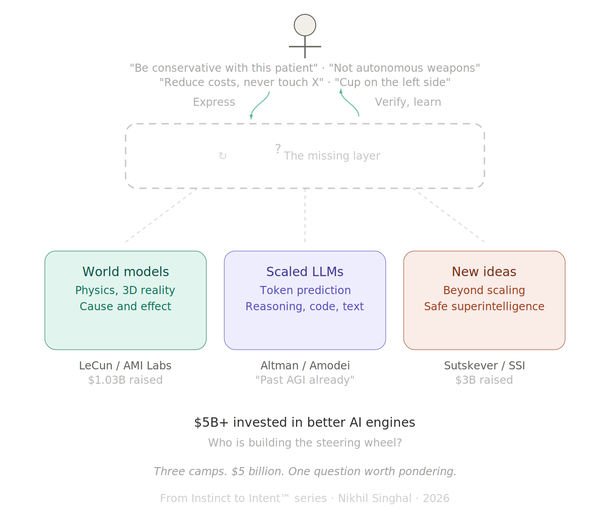

# Everyone Is Arguing About the Engine. Who Is Building the Steering Wheel?

**FROM INSTINCT TO INTENT™ SERIES**

*Three camps. $5 billion. One question worth pondering.*

The biggest debate in AI right now is about what kind of engine should power it.

In one corner, Yann LeCun left Meta, raised $1.03 billion for AMI Labs, and declared that large language models are a "dead end." His bet: world models, AI systems that learn from 3D reality and understand physics, cause and effect, the way objects actually behave. Not the way text describes them behaving. "The AI industry is completely LLM-pilled," he said at Davos in January. "Everyone is digging the same trench."

<!-- more -->

In the other corner, Sam Altman says we are already past AGI and headed toward superintelligence. Dario Amodei told the same Davos audience that AI would replace the work of all software developers within a year and reach Nobel-level scientific research in two. The bet: LLMs are the path, and scale plus better reasoning will get us there.

In a third corner, Ilya Sutskever, the former chief scientist of OpenAI, quietly founded Safe Superintelligence with $3 billion and zero products. His position: "The era of just adding GPUs is over." The next breakthrough is not bigger models. It is better research. New architectures, new training methods, new ideas.

Of the three, Sutskever may be closest to the right instinct. He is not betting on a specific engine. He is betting that the answer has not been found yet. But even his framing points at the engine: what kind of model, what kind of architecture, what kind of training. The question of what sits between the human and whatever engine emerges has not been part of his public thesis either. The opening is there. The question has not been asked.

Over $5 billion raised in the last 90 days on the question of which engine powers the future of AI. The debate is fierce, the money is real, and the stakes are existential.

I have been watching this debate closely. I have also been building with AI every day for ten months. And the more I build, the more I think Sutskever's instinct is right: the answer has not been found yet, and we need new ideas. But the idea I keep coming back to is not about the engine at all.

---

## What Each Camp Gets Right

I am not going to pick a side. All three camps have compelling arguments, and understanding each one matters more than choosing a winner.

LeCun is right that LLMs have real limitations. They can discuss physics without understanding physics. They describe spatial relationships without perceiving space. A four-year-old child has seen roughly fifty times more data than any LLM, but most of it is visual and sensory, not textual. The child learns that unsupported objects fall through experience. The LLM learns that the word "gravity" tends to appear near certain other words. LeCun's critique is not hand-waving. It is technically precise.

Altman and Amodei are right that LLMs work. I know this firsthand. I have shipped eight products in ten months using Claude Code as my primary development partner. Nearly three thousand commits across fourteen repos. The AI writes TypeScript, Python, React, SwiftUI. It builds, debugs, restructures, ships. Whatever the theoretical limitations of token prediction, the practical capability is extraordinary and accelerating.

Sutskever is right that scaling has limits and that the field needs genuinely new thinking. The marginal gains from making models bigger are getting smaller. "There are more companies than ideas," he observed. "By quite a bit." The next leap will come from someone who finds a fundamentally different approach, not from someone who buys more GPUs.

Three world leaders in AI. Three defensible positions. Two are betting on specific engines. One is betting that the right engine has not been invented yet.

But even in Sutskever's open-ended framing, the conversation is about the engine. The question of who drives it, and how, has not entered the debate in any meaningful way.

---

## The Shared Blind Spot

Here is the question that has received almost none of that $5 billion in attention: once you build the engine, whether it runs on tokens, physics simulations, or something that does not exist yet, how does the human tell it what to do?

Not in natural language. Natural language is ambiguous by design. "Be conservative with this patient" means something different to every doctor, every nurse, every AI system that tries to interpret it.

Not through a text box. The text box is the same interface we had in 2023. The models got smarter. The reasoning got deeper. The interface stayed the same: a blank rectangle where you type words and hope for the best.

LeCun's world models would understand that a cup falls when unsupported. But would they understand that the surgeon needs the cup placed on the left side of the tray, not the right, because the left is where this particular surgeon always reaches first? That kind of intent is specific to the human, specific to the context, and it evolves continuously. It requires the AI to learn each user the way a trusted colleague would, over time, through interaction, building a shared understanding that no single mechanism, whether documents, conversations, or training data, has been able to deliver reliably at world scale.

Altman's scaled LLMs would generate code faster and with fewer errors. And yes, AI is rapidly expanding its reach into organizations. It already reads files, calendars, emails, codebases. It will eventually know about the compliance decision made three months ago in a meeting the AI never attended. But knowing a constraint and being structurally bound to respect it are two different things. Access is not governance. The Anthropic and Pentagon standoff in February showed what happens when two parties have different declarations of intent and no structural way to resolve them. One said "not autonomous weapons, not mass surveillance." The other said "any lawful use." The result was a supply chain risk designation, not a resolution. The AI had access to everything. What was missing was a structural agreement on intent.

Sutskever's open-ended research agenda has the most room for this question. If the next breakthrough requires genuinely new ideas, the interface between human intent and machine execution could be one of them. But so far, his public framing has focused on model architecture and safety, not on the structural gap between what humans mean and what machines do.

A better engine does not solve the interface problem. It makes the interface problem more urgent, because a more powerful engine executing on misunderstood intent does more damage, faster.

---

## The Evidence That the Gap Is Growing

In the previous article in this series, I examined what I called "Instance One" of the intent gap: programming languages. Code is where the gap is most measurable, because code has verifiable outputs. You can see exactly where what the human meant diverged from what the AI produced.

The data is striking. Ankit Jain's research across over 10,000 developers and 1,255 teams showed that AI adoption increased code output by 98% and increased review time by 91%. A METR randomized controlled trial found experienced developers were 19% slower with AI coding tools, despite believing they were 24% faster.

The intent gap is the distance between what the human meant and what the AI produced. That 91% increase in review time is not a code quality problem. It is humans spending more time checking whether their intent survived the translation.

But this is not just a programming problem. The gap shows up everywhere intent meets AI. A hospital says "be conservative with this patient" and every system interprets it differently. The Pentagon says "any lawful use" and Anthropic says "not autonomous weapons," and there is no structural layer to reconcile the two. A CEO tells an AI agent "reduce costs" and has no way to specify what that means and what it must never touch. These are not programming language problems. They are intent problems. The same structural gap, different domains.

I feel this every day when I build. The AI generates code beautifully. The hardest part is never the generation. The hardest part is making sure the AI respects what I meant, not just what I said. Every prompt is a lossy compression of my actual intent. Every review cycle is me checking whether the loss was acceptable. This is not a bug in the current generation of models. It is a structural pattern: the better the engine gets, the wider the gap between generation and verification, because the translation layer from what the human meant to what the machine did has not improved at the same rate as the engine.

Whether that gap closes in three years or thirty, whether it narrows gradually with better models or requires a structural breakthrough of its own, is genuinely unknown. What is clear is that the billions being invested right now are aimed at the engine, not at the gap.

---

## The Honest Position

I do not know what the solution looks like.

I do not know if it is a new language, a protocol, a layer in the software stack, or something that has not been invented yet. I do not know if it gets solved by sufficiently advanced AI that can infer intent so well that explicit declaration becomes unnecessary.

To be clear: early forms of structural intent already exist. System prompts, constitutional AI, reinforcement learning from human feedback, project-level configuration files, memory systems that learn preferences over time. Interfaces are evolving rapidly. Agents read codebases, calendars, and conversation history. These are real and meaningful steps. But richer context is not the same as structural constraint. An AI that knows everything about you but has no enforceable boundaries on what it can do with that knowledge is not governed. It is informed. The surgeon's left-hand preference, the organization's compliance decision, the nation's red line on autonomous weapons: none of these live reliably in any of those mechanisms today. The seeds exist. The coherent layer does not.

And the problem itself is not new. Humans have been solving it with each other for thousands of years. Gestures became spoken language. Spoken language became writing. Writing became contracts. Contracts became laws. Laws became digital protocols. Each step made intent more structural, more verifiable, more enforceable across distance and time. A handshake became a legal contract became a machine-readable API. We have always needed intent layers. We have just never needed one for a non-human intelligence before.

Perhaps part of the problem is the word "artificial." As long as we frame this as something less than intelligence, we give ourselves permission to skip the communication infrastructure we would never skip with a human colleague.

In a job interview years ago, a manager asked me: imagine we are in the future and space travel is common. We have built a device that translates what an alien species says in their language and what we say in ours. How would this device work? He and I discussed it for two hours. I kept throwing ideas at him. Some landed. Many did not. But we talked, tested, locked what worked, and moved to the next step. By the end, we had not just answered the question. We had demonstrated the answer. We built a shared model of intent through the conversation itself.

That is what Andy Weir shows in Project Hail Mary. Two beings who share nothing, not language, not biology, not even the same atmosphere, build a shared vocabulary from numbers up. Every concept is verified before the next one builds on it. That is not translation. That is an intent layer being constructed between two alien intelligences in real time. The analogy is imperfect. AI already speaks our language. But speaking a language and structurally respecting intent expressed in that language are different problems, as anyone who has been misunderstood by a fluent colleague can attest.

We are building that same bridge right now. Except the alien intelligence is one we created ourselves.

What I do know is this: the question of how the human structurally expresses what the AI must respect has received very little attention from the camps spending billions right now. LeCun is asking what engine to build. Altman is asking how big to make it. Sutskever is asking what new ideas might replace the current approach entirely, and of the three, his framing leaves the most room for this question to surface. But it has not surfaced yet.

The question about the steering wheel, how does the human declare intent in a form that any engine can honor, survives regardless of which camp wins. It may even be one of the "new ideas" Sutskever is looking for.

I have been calling this the Intent Layer. Not because I have a product or a framework or a specification. Because after ten months of building with AI every day, across eight products and nearly three thousand commits, the pattern is unmistakable. The bottleneck is rarely the AI's capability. The bottleneck is the human's ability to express what they actually want in a form the AI can structurally respect.

And that bottleneck is architecture-agnostic. It does not care whether the model underneath is predicting tokens, simulating physics, or doing something we have not imagined yet. The gap between human intent and machine execution is the same gap at every level of the stack.

---

## Why This Matters Now

There is a reason this question cannot wait for the engine debate to resolve.

Enterprises are deploying AI agents today. Not in two years when world models mature. Not in five years when safe superintelligence arrives. Today. And those agents are executing on intent expressed in natural language, through dashboards, through policy documents that no machine can enforce.

Governments are writing AI regulation today. The EU AI Act is the most comprehensive AI regulation on earth, and even the EU is discovering that binding rules without technical standards to implement them are words on paper. The US, China, Japan, Australia, India, Brazil, Saudi Arabia: every nation is trying to express what AI should and should not do, using the same ambiguous medium that fails when a single developer talks to a single AI through a text box.

The scale changes. The gap does not.

In my first article in this series, "Discovering Intent," I called this the missing interface between human judgment and machine execution. In the second, "Languages Designed for Humans," I showed how it manifests in programming languages, the first domain where the gap is becoming impossible to ignore.

This article is about a simpler claim: the gap is architecture-agnostic. LLMs, world models, and whatever comes next all face the same structural problem. And the billions being spent on better engines, while necessary, will not close a gap that lives above the engine layer entirely.

Everyone is arguing about the engine. The steering wheel is still missing.

I do not know who will build it. I do not know what it will look like. But I know the question is real, because I feel it every time I sit down to build, and the AI does exactly what I said instead of what I meant.

---

## References

1. **Yann LeCun**, AMI Labs founding announcement and Davos remarks, January 2026. "LLMs are a dead end." $1.03 billion raised at $3.5 billion valuation. [TechCrunch](https://techcrunch.com/2026/03/09/yann-lecuns-ami-labs-raises-1-03-billion-to-build-world-models/), [Fortune](https://fortune.com/2026/01/23/deepmind-demis-hassabis-anthropic-dario-amodei-yann-lecun-ai-davos/).

2. **Sam Altman**, remarks on AGI and superintelligence, January 2026. "We are already beginning to slip past human-level AGI toward superintelligence."

3. **Dario Amodei**, Davos AI Summit remarks, January 2026. AI to replace all software developers within one year. Nobel-level research in two years. 50% of white-collar jobs in five years. [Fortune](https://fortune.com/2026/01/23/deepmind-demis-hassabis-anthropic-dario-amodei-yann-lecun-ai-davos/).

4. **Ilya Sutskever**, Dwarkesh Podcast interview, November 2025. "The era of just adding GPUs is over." "There are more companies than ideas. By quite a bit." SSI raised $3 billion. [Dwarkesh Podcast](https://www.dwarkesh.com/p/ilya-sutskever-2).

5. **Anthropic/Pentagon standoff**, February-March 2026. Anthropic walked away from DoW contract over "any lawful use" language. Declared supply chain risk. [Fortune](https://fortune.com/2026/03/06/anthropic-openai-ceo-apologizes-leaked-memo-supply-chain-risk-designation/), [TechCrunch](https://techcrunch.com/2026/03/04/anthropic-ceo-dario-amodei-calls-openais-messaging-around-military-deal-straight-up-lies-report-says/).

6. **Ankit Jain**, "How to Kill the Code Review," *Latent.Space*, March 2026. 98% more PRs, 91% more review time. 10,000+ developers across 1,255 teams.

7. **METR** (Model Evaluation and Threat Research), randomized controlled trial, July 2025. Experienced developers 19% slower with AI tools despite perceiving 24% improvement.

8. **LeCun**, MIT Technology Review interview, January 2026. "LLMs are now technology development, not research." Data efficiency: a four-year-old has seen ~50x more data than an LLM, mostly visual/sensory. [MIT Tech Review](https://www.technologyreview.com/2026/01/22/1131661/yann-lecuns-new-venture-ami-labs/).

9. **Andy Weir**, *Project Hail Mary*, 2021. Two alien species build a shared communication framework from numbers up, verifying each concept before building on it.

10. **Nikhil Singhal**, "Discovering Intent: The Journey That Starts Before You Are Ready," *From Instinct to Intent™ Series*, March 2026. [Medium](https://nikhilsinghal-ai-trust-commons.medium.com/discovering-intent-the-journey-that-starts-before-youre-ready-4a8a69fce594) | [aitrustcommons.org](https://aitrustcommons.org/blog/2026/03/08/discovering-intent/).

11. **Nikhil Singhal**, "We Are Making AI Write Code in Languages Designed for Humans. That Is the Problem," *From Instinct to Intent™ Series*, March 2026. [DOI: 10.5281/zenodo.19005877](https://doi.org/10.5281/zenodo.19005877).

---

**Published simultaneously on:**

Medium (link forthcoming)

Zenodo (DOI forthcoming)

---

*This is the third article in the From Instinct to Intent™ series. The first, "Discovering Intent," and the second, "Languages Designed for Humans," are available on [Medium](https://nikhilsinghal-ai-trust-commons.medium.com/) and [aitrustcommons.org](https://aitrustcommons.org/blog/).*

*Nikhil Singhal is the founder of AI Trust Commons and a technology executive with 25+ years of engineering leadership. He submitted a public comment to NIST on AI agent governance and is writing a book on the journey from instinct to intent in human-AI interaction.*
