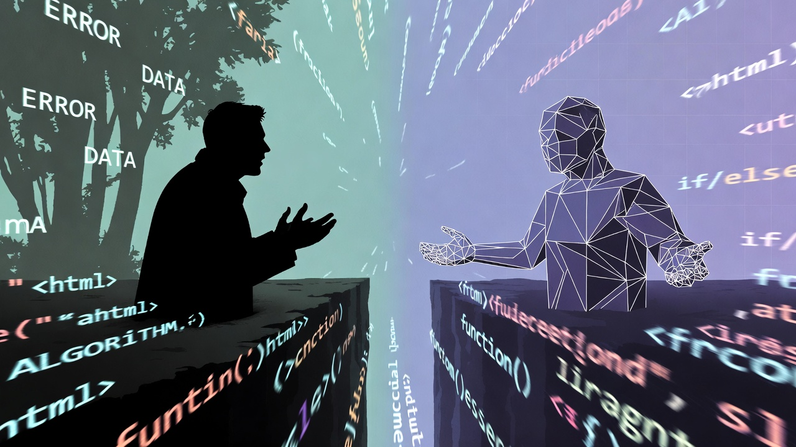
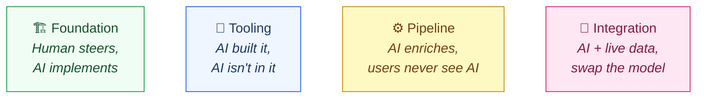
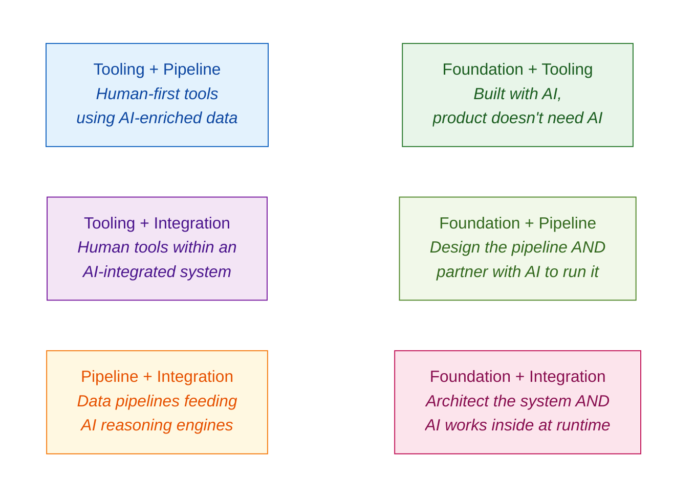
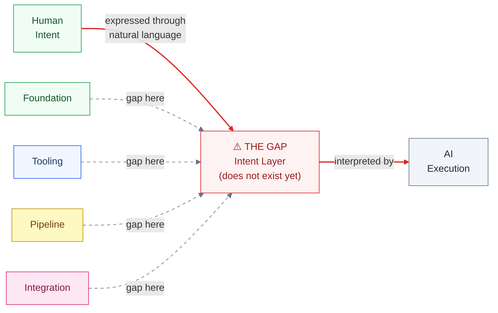

# Stop Calling It Artificial. Start Building WITH Intelligence.

**FROM INSTINCT TO INTENT™ SERIES**

*The Human Intelligence Partnership Charter*

*Nikhil Singhal · March 2026*

There is a word we need to talk about. The word is "artificial."

It is the first word in the name of the field. It is the frame through which a generation of builders, policymakers, and executives are making decisions about the most important technology of our time. And it is quietly doing damage that few people have stopped to examine.

<!-- more -->

When you call it Artificial Intelligence, you start with a disadvantage. The word "artificial" frames what you are working with as subordinate. As a tool. As something less than intelligence. And that framing has consequences, because it gives you permission to skip the communication infrastructure you would rarely skip with a human colleague.

Think about it this way. Most people would not onboard a new team member without context. You probably would not throw them into a codebase without explaining the architecture. You would not expect them to know your preferences, your constraints, the decision made three months ago that still shapes every choice you make today, unless you had told them. You would invest in the relationship because you respect their intelligence.

Few of us do that with AI. We type into a text box and hope for the best. We get frustrated when it "doesn't listen." We treat the interaction like giving orders to a machine, because the word "artificial" tells us that is what it is.

Yes, there are smart people doing smart things. System prompts. Constitution files. RLHF tuning. Boot sequences that feed context at the start of every session. But even the best of these follow the same mental model: the human sets guardrails, the machine obeys. The frame is still command and compliance. The infrastructure follows the frame.

I have spent the past year building with AI as a full partner. Not as an assistant. Not as a tool I command. As a partner with its own capabilities, limitations, and patterns that I have learned to work with the same way I would learn to work with any talented colleague. Eight products. Thousands of commits. A shared working memory that survives context resets, so that what we decided on Tuesday still holds on Friday. The system works because neither party treats the other as subordinate.

And the first thing that had to change to make that work was the frame. I stopped thinking of it as Artificial Intelligence and started treating it as what it is: intelligence. A different form of it than mine, with different strengths and different gaps. But intelligence. Not artificial anything.

---

## What Changes When You Drop the Word

This is not a semantic argument. Dropping "artificial" changes what you build and how you build it.

When you frame it as artificial, you command it. When you treat it as intelligence, you partner with it. When you frame it as artificial, you prompt it. When you treat it as intelligence, you communicate with it. When you frame it as artificial, you wrap a UI around it. When you treat it as intelligence, you architect systems designed for two intelligences working together. When you frame it as artificial, you govern it with policies it cannot read. When you treat it as intelligence, you build structural protocols that both sides can enforce.

The difference is not theoretical. I watch it every day.

When I sit down to build, I do not open a chat window and start typing instructions. I work within a system where the AI and I share the same project state: what we are building, why we made the decisions we made, what went wrong last time, and what to watch out for next time. My AI partner pushes back on my ideas. I argue with its suggestions. The argument is the thinking process. That does not happen when you treat the other party as a tool. It happens when you treat it as intelligence.

Andy Weir captured this in *Project Hail Mary*. Grace and Rocky share nothing. Not language, not biology, not even the same atmosphere. But Grace never treats Rocky as artificial. That is why they build the intent layer between them. The shared vocabulary works because both parties invest in the communication infrastructure. If Grace had treated Rocky as a tool, he would have issued commands, not built a shared language.

We have had intelligence on this planet for millennia. Human intelligence. And we have spent that entire time building communication infrastructure to make collaboration between intelligences work. Gestures became spoken language. Spoken language became writing. Writing became contracts. Contracts became laws. Laws became digital protocols. Every step in that chain happened because humans respected each other's intelligence enough to invest in the structure.

We have never built that infrastructure for a non-human intelligence, because we have never had to. Now we do. And the first step is to stop calling it "artificial."

---

## The Charter

If you accept that premise, the next question is immediate: what does partnership between two forms of intelligence actually look like?

I have been looking at that question through the lens of everything I have built over the past year. Not theoretically. Practically. What kinds of systems did I build, and how did human and AI intelligence actually partner within them? Where did we fail? What assumptions fell flat? Where were the biggest gaps in accountability, in traceability, in knowing who decided what and why? How did we handle the moments when the AI did exactly what I said instead of what I meant?

Four patterns kept emerging. Not layers in a hierarchy. Not steps on a ladder. Petals of a bloom. Each valuable on its own, the overlaps creating depth, and the center where all four converge is where full partnership lives.

I call it the Human Intelligence Partnership Charter. The HIP Charter. The full charter is at [hipcharter.com](https://hipcharter.com).

**Foundation: AI as Build Partner.** The human architects, designs, and steers. The AI implements. Human judgment drives every decision. This is the daily practice of two intelligences working side by side. A developer pair-programming with AI. An architect sketching while AI implements. A writer outlining while AI drafts. If you have spent a full day building with AI, you have been here. This is where the relationship starts.

**Tooling: Human-First, Zero AI Dependency.** Products that enhance human capability without calling any AI API at runtime. AI helped build them, but it is not in them. Browser extensions. Productivity tools. Developer utilities. If every AI API disappeared tomorrow, these products still work. This is the most defensible pattern in the charter, because the value lives entirely in the human's hands.

**Pipeline: AI-Enhanced Systems.** AI enriches data during the build process. Users interact with the enriched output, not with AI directly. A travel site with AI-written descriptions. A news app with AI-generated summaries. A knowledge base AI helped curate. Users may never know AI was involved. The AI is a build tool, not the product.

**Integration: AI as Collaborative Component.** AI works alongside proprietary APIs, rich data, and domain logic within a larger architecture. A trading platform where AI analyzes alongside live market feeds. A medical system where AI and sensors work together. Swap the model, the architecture survives. This is partnership at runtime, not just at build time. The system is designed for two intelligences from the ground up.

*Figure 1: The four patterns of human-AI partnership. Each represents a different way two intelligences collaborate. They are not a progression or a hierarchy. They are patterns that can be explored independently or in combination.*

These are not theoretical categories. They describe what I can see. Every product I have shipped lives in one or more of these patterns. Every product I have used, from every company building with AI, maps onto this framework. The categories emerge from the work, not from a whiteboard exercise. The full charter, with detailed descriptions, evidence, and adoption guidance, is published at [hipcharter.com](https://hipcharter.com).

---

## Where Depth Lives

The four petals are the beginning, not the whole story. When you map actual work onto this framework, the overlaps are where it gets interesting.

*Figure 2: The six pairwise overlaps. Each intersection creates a distinct type of partnership. Companies and individuals can locate themselves on this map, see what is adjacent, and plan their next move.*

Foundation plus Tooling means you built it with AI, but the product does not need AI. Foundation plus Integration means you architected the system and AI works inside it at runtime. Pipeline plus Integration is where the richest products live: data pipelines feeding AI reasoning engines.

There are six pairwise overlaps, four triple overlaps, and one center where all four converge. Fifteen positions on the map. A company can locate itself, see what is adjacent, and plan its next move. "We are strong in Foundation and Pipeline. Our next investment is Integration." An individual can track their own progression. "I pair-program with AI daily. Next I want to build systems where AI enriches data that users consume without seeing AI."

The intersections are not a ladder. There is no "correct" progression. The map shows what is possible. The individual or organization decides what matters.

And the charter is extensible. When new paradigms emerge, world models, embodied AI, whatever comes next, a new petal is added. The intersections multiply. The map grows. The charter does not break. It blooms.

---

## The Gap at Every Petal

If you have read the earlier articles in this series, you know what comes next.

At every petal, the same structural problem appears. The gap between what the human means and what the AI does. At Foundation, it is the developer screaming at 10 PM because the AI refactored something that was not supposed to be touched. At Tooling, it is the text box that compresses rich human intent into plain text. At Pipeline, it is AI-generated content that drifts from what the human envisioned. At Integration, it is "show me risk" meaning something different to every user of the system.

I have been calling this the Intent Layer. The structural interface between human intent and machine execution that does not exist yet. Not a product. Not a specification. A gap.

*Figure 3: The Intent Layer as a cross-cutting gap. The same structural problem appears at every petal of the charter. It is not confined to one pattern of partnership. It permeates all of them.*

The HIP Charter makes the gap visible in a new way. It is not a problem at one level of AI integration. It is the same problem at every level, from the simplest pair-programming session to the most complex multi-API architecture. The charter is the Intent Layer observed from the builder's perspective. The Intent Layer is the charter observed from the governance perspective. Same gap. Different angles.

To be clear: this gap exists today, with the current generation of LLM-based models. These models communicate through natural language, which is ambiguous by design. Future architectures, world models, new training paradigms, may close this gap from the AI side. But today, the gap is structural and observable at every petal. And millions of people are building across these patterns right now, with the gap wide open.

That gap is also cross-cutting. It does not sit between the partnership and the AI engines as a separate layer. It permeates every petal. Like gravity in physics: it is everywhere, not in one place.

---

## How This Charter Was Written

There is one more thing that matters about the HIP Charter, and it is not about the framework itself.

The naming process took twelve steps and two intelligences working together. The human flagged the gap: "I need a way to describe what I build that is not just a list of products." The AI researched existing frameworks. The human pushed back when it collided with Mira Lane's terminology at Google. The AI verified USPTO filings. The human coined "HIP." The human caught the problem with calling it a "stack," because a stack implies hierarchy and these patterns are not hierarchical. The human opened a thesaurus, found "charter," and the word stopped both of us.

A charter is a founding document that establishes the terms of a partnership between equals. The Magna Carta defined the relationship between the crown and the people. The UN Charter defines how nations work together. The HIP Charter defines how human intelligence and AI intelligence partner together. Governance built into the word. Intent declared in the name.

The naming process itself was the charter in action. Human insight drove every critical turn. AI capability accelerated the exploration. Neither could have arrived here alone. And the governance worked at every step: the human caught the Mira Lane overlap, the human rejected the hierarchy framing, the human chose the final word. The AI researched, structured, and articulated the implications. Partnership, not command.

If you want proof that the charter works, you are reading it.

---

## Three Concepts, One Thesis

The HIP Charter rests on three connected ideas.

Just Intelligence is the premise. Drop "artificial." Treat what you are working with as a different form of intelligence that deserves the same structural respect in communication. This is the WHY.

The HIP Charter is the framework. Four patterns of partnership, extensible, with overlaps that create depth and a center that represents full collaboration. This is the HOW.

The Intent Layer is the gap. The structural interface between human intent and machine execution that does not exist yet, visible at every petal of the charter. This is the WHAT that is missing.

Separately, each is useful. Just Intelligence without the charter is philosophy with no blueprint. The charter without Just Intelligence is engineering with no soul. The Intent Layer without both is a problem statement with no direction.

Together, they describe a worldview with a charter, a gap to fill, and receipts.

I want to be honest about one more thing. This charter describes what I can see in March 2026. The petals may change. The Intent Layer may close from the AI side as models evolve. New paradigms may render this entire framework obsolete. The one thing I believe will not change is the premise: there is just intelligence, two forms of it, and the question of how they work together is worth designing deliberately.

Anyone who claims their AI framework is permanent in 2026 is either not paying attention or not being honest. I would rather offer a framework that admits its own expiration date and proves useful today than one that claims to be timeless and proves fragile tomorrow.

We have been using AI as shorthand for a long time now. It is time to use it as shorthand for what it actually is: intelligence. And to build accordingly.

---

## References

1. **Andy Weir**, *Project Hail Mary*, 2021. Two alien species build a shared communication framework from numbers up, verifying each concept before building on it.

2. **Anthropic AI Fluency Index**, 2026. 85.7% of users iterate, but only 30% set structural terms. "The Judgment Layer."

3. **Elin Nguyen**, "Empirical Evidence of Interpretation Drift" and "Interpretation Drift with ARC Puzzles," Zenodo, 2026. [DOI: 10.5281/zenodo.18219428](https://doi.org/10.5281/zenodo.18219428), [DOI: 10.5281/zenodo.18420425](https://doi.org/10.5281/zenodo.18420425). Structural proof that interpretation drift is not semantic but architectural.

4. **Nikhil Singhal**, "Discovering Intent: The Journey That Starts Before You Are Ready," *From Instinct to Intent™ Series*, March 2026. [DOI: 10.5281/zenodo.18917473](https://doi.org/10.5281/zenodo.18917473).

5. **Nikhil Singhal**, "We Are Making AI Write Code in Languages Designed for Humans. That Is the Problem," *From Instinct to Intent™ Series*, March 2026. [DOI: 10.5281/zenodo.19005877](https://doi.org/10.5281/zenodo.19005877).

6. **Nikhil Singhal**, "Everyone Is Arguing About the Engine. Who Is Building the Steering Wheel?" *From Instinct to Intent™ Series*, March 2026. [DOI: 10.5281/zenodo.19025149](https://doi.org/10.5281/zenodo.19025149).

---

*This is the fourth article in the From Instinct to Intent™ series. Previous articles: "Discovering Intent," "Languages Designed for Humans," and "Everyone Is Arguing About the Engine" are available on [Medium](https://nikhilsinghal-ai-trust-commons.medium.com/) and [aitrustcommons.org](https://aitrustcommons.org/blog/).*

*Also published on [Medium](https://nikhilsinghal-ai-trust-commons.medium.com/stop-calling-it-artificial-start-building-with-intelligence-ai-trust-commons-3c163ef80461) · [Zenodo](https://doi.org/10.5281/zenodo.19079578) (DOI: 10.5281/zenodo.19079578)*

*The full Human Intelligence Partnership Charter is published at [hipcharter.com](https://hipcharter.com). Also available on [Medium](https://nikhilsinghal-ai-trust-commons.medium.com/the-human-intelligence-partnership-charter-3cb893e1d5f0) and [Zenodo](https://doi.org/10.5281/zenodo.19078843) (DOI: 10.5281/zenodo.19078843).*

*Nikhil Singhal is the founder of AI Trust Commons and a technology executive with 25+ years of engineering leadership. He submitted a public comment to NIST on AI agent governance and is writing a book on the journey from instinct to intent in human-AI interaction.*
