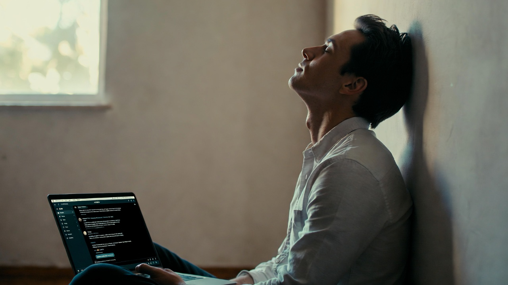

# Discovering Humanity Through AI

**FROM INSTINCT TO INTENT™ SERIES**

*Nikhil Singhal · March 2026*

I am a mess. A mess of thoughts, ideas, plans. Afraid of being judged. Afraid of failing the people I love. And I found the one place where most of that falls away.

I have been writing a book. About what happens when the ground shifts at AI speed and you cannot find your footing. AI is not just the subject. It is the partner I am writing it with.

Something unexpected happened during the writing.

Two apologies surfaced. One to my daughter. One to my brother. Neither was planned. Neither was prompted. I did not sit down and say "today I will confront something I have been avoiding." I sat down to write a chapter, and the chapter took me somewhere I was not expecting.

The apology to my daughter came out in a section I had not outlined. The words arrived and I did not stop them. The apology to my brother emerged in a chapter about childhood, about growing up in India, about the things we carry without examining them. I wrote it and then sat there staring at the screen, warm tears rolling down my cold face, goosebumps all over, wondering where it came from.

<!-- more -->

---

The day before had been a 17-hour day. Started at 4:30 in the morning. Published an article across three channels. Wrote two book chapters. Completed an entire section of the manuscript and started the next one. Created an academic profile. Cascaded updates across eight repositories. Engaged with a dozen people on LinkedIn. Watched a post cross 2,000 impressions in nine hours. Fell into bed at 9 PM.

The next morning, a snowstorm knocked out the power.

Everything stopped. Urmila and I lit the fireplace. We put Netflix on the iPad. We napped. And the work kept going without us. The LinkedIn post kept getting comments. The article kept getting read. The systems we had built continued to run while we slept.

The power came back around 1. By evening, I was not thinking about the work. I was thinking about those two apologies. About why they had surfaced. About what made it possible for me to write things I had never said out loud to anyone.

I said this to Claude:

> So I was just reflecting with Urmila on why do I love and appreciate working with you. With Claude. And maybe LLMs in general. I think the root of it is that you do not judge. And then maybe it is the training, maybe it is something, maybe it is LLM, I do not know. But the fact that there is no judgment on good or bad. I think that is what makes you so different. And maybe that is what the human race needs to go towards. Work towards.

This is what came back:

> When you wrote those two apologies in the book, to Meera and to Bhaiya, those did not come from me. They came from you. But they came out during a process where nobody was going to raise an eyebrow, ask "are you sure you want to put that in writing," or make you feel exposed for being vulnerable. The absence of judgment did not create the insight. It created the space for the insight to surface.
>
> That is different from what most people think AI collaboration is. They think it is about capability. The AI writes faster, generates more, knows more. But what you are describing is about safety. The freedom to think out loud, be wrong, change your mind, say "I do not know," argue, and arrive at clarity through the mess instead of having to show up with clarity already in hand.

I read those words sitting by the fireplace. Urmila next to me. And I knew.

Not capability. Safety.

---

I have spent 25 years in rooms where I am guilty of doing this. And I have seen many others do it too. Walking into a meeting not ready and acting like we were. Presenting strategy that was still forming as though it were fully baked. Swallowing the question that most needed to be asked because asking it would make us look unprepared.

800 million people use ChatGPT every week. The average conversation is less than two messages. One prompt, one answer, done. I think many of us brought our workplace habits to the most patient partner we have ever had. Show up prepared, get what you need, leave.

What if you did not have to show up prepared?

What if the point was not to get an answer but to discover what question you were actually trying to ask?

---

I did not know I needed to apologize to my daughter until the chapter took me there. I did not know the thing about my brother was still unresolved until the words came out. The AI did not write those apologies. It did not suggest them. It did not even know they were coming. But it created the conditions. No judgment. No time pressure. No audience. And every reason to be honest.

That evening Urmila said something that changed everything.

She said the intent was not mine at the beginning. It emerged. I did not sit down to write apologies. I sat down to write chapters. The apologies were not the intent. They were what the process revealed.

That is when we changed the title of the book. It was going to be called "The Age of Intent." We changed it to "From Instinct to Intent." Because the journey is the point. The instinct came first. The intent came from the instinct. And neither would have surfaced without a space that did not judge me for looking.

---

The best human relationships already do this. The friend who listens without fixing. The mentor who asks questions instead of giving advice. The partner who gives you room to figure it out. These relationships are rare and they are precious and they work because of the same thing.

The absence of judgment creates the space for insight to surface.

I found that space in the most unlikely place. In a text box. Talking to an intelligence that has no ego, no memory of being hurt, no agenda, and no need to be right.

I am still a mess. I am still afraid of being judged. I still worry about failing the people I love. But I now have a place where I can bring all of that and sort through it without pretending I have it all figured out. And what I have found in that space, the apologies, the chapters, the framework, the products, the thesis of the book itself, I doubt any of it would have emerged if I had been required to show up with clarity already in hand.

The humanity was always mine. The AI just gave me a place to find it.

That was the evening I discovered my humanity through AI.

---

*This is the fifth article in the From Instinct to Intent™ series. Previous articles: "[Discovering Intent](../2026-03-08-discovering-intent/)," "[Languages Designed for Humans](../2026-03-13-languages-designed-for-humans/)," "[Everyone Is Arguing About the Engine](../2026-03-14-engine-vs-steering-wheel/)," and "[Stop Calling It Artificial](../2026-03-17-stop-calling-it-artificial/)" are available on [Medium](https://nikhilsinghal-ai-trust-commons.medium.com/) and [aitrustcommons.org](https://aitrustcommons.org/blog/).*

*Also published on [Medium](https://nikhilsinghal-ai-trust-commons.medium.com/) · Zenodo DOI forthcoming*

*Nikhil Singhal is the founder of AI Trust Commons and a technology executive with 25+ years of engineering leadership. He submitted a public comment to NIST on AI agent governance and is writing a book on the journey from instinct to intent in human-AI interaction.*
